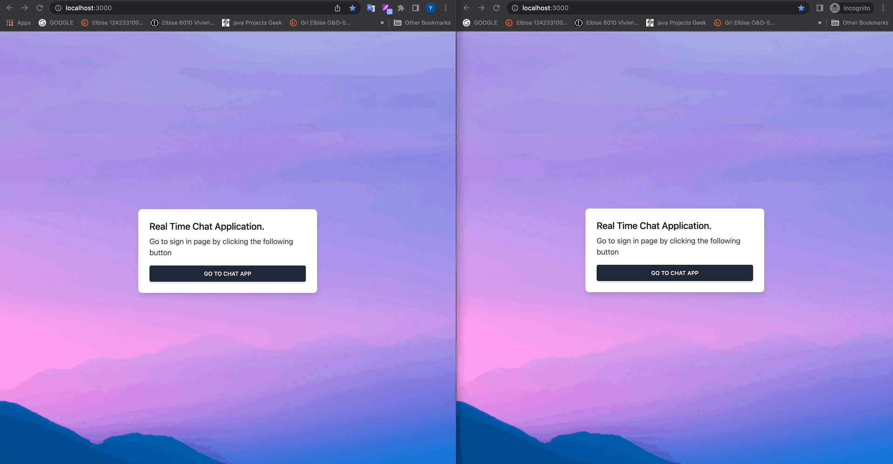

# Prisma + tRPC + WebSockets

Try demo


## Features

- 🧙‍♂️ E2E type safety with [tRPC](https://trpc.io)
- ⚡ Full-stack React with Next.js
- ⚡ WebSockets / Subscription support
- ⚡ Database with Prisma
- 🔐 Authorization using [next-auth](https://next-auth.js.org/)
- ⚙️ VSCode extensions
- 🎨 ESLint + Prettier
- 💚 CI setup using GitHub Actions:
    - ✅ E2E testing with [Playwright](https://playwright.dev/)
    - ✅ Linting

## Setup

```bash
yarn create next-app --example https://github.com/trpc/trpc --example-path examples/next-prisma-starter-websockets trpc-prisma-starter-websockets
cd trpc-prisma-starter-websockets
yarn
yarn dx
```

## Deployment

### Using [Render](https://render.com/)

The project contains a [`render.yaml`](./render.yaml) [_"Blueprint"_](https://render.com/docs/blueprint-spec) which makes the project easily deployable on [Render](https://render.com/).

The database is setup with a `starter` plan, but you can use a free plan for 90 days.

Go to [dashboard.render.com/blueprints](https://dashboard.render.com/blueprints) and connect to this Blueprint and see how the app and database automatically gets deployed.

You will either need to create an environment group called `trpc-websockets` with environment variables or remove that from `render.yaml` in favor of manual environment variables that overrides the ones in `/.env`.

## Files of note

<table>
  <thead>
    <tr>
      <th>Path</th>
      <th>Description</th>
    </tr>
  </thead>
  <tbody>
    <tr>
      <td><a href="./prisma/schema.prisma"><code>./prisma/schema.prisma</code></a></td>
      <td>Prisma schema</td>
    </tr>
    <tr>
      <td><a href="./src/api/trpc/[trpc].tsx"><code>./src/api/trpc/[trpc].tsx</code></a></td>
      <td>tRPC response handler</td>
    </tr>
    <tr>
      <td><a href="./src/server/routers"><code>./src/server/routers</code></a></td>
      <td>Your app's different tRPC-routers</td>
    </tr>
  </tbody>
</table>

## Commands

```bash
pnpm build      # runs `prisma generate` + `prisma migrate` + `next build`
pnpm db-nuke    # resets local db
pnpm dev        # starts next.js + WebSocket server
pnpm dx         # starts postgres db + runs migrations + seeds + starts next.js
pnpm test-dev   # runs e2e tests on dev
pnpm test-start # runs e2e tests on `next start` - build required before
pnpm test:unit  # runs normal jest unit tests
pnpm test:e2e   # runs e2e tests
```
---
